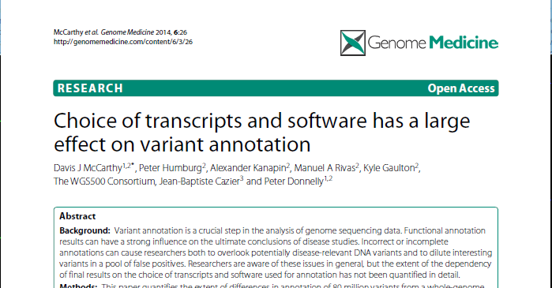
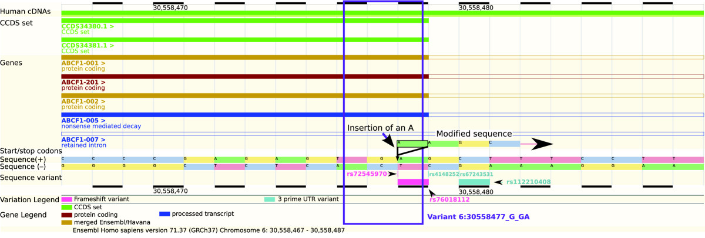

# Interpreting genomic variation

* Sequencing of patient genomes increasingly common
* Can identify relevant variants

. . .

* ... amongst a large number of unrelated variants
* Computational strategies can narrow the set of candidates

. . .

* ... but non-coding variants are difficult to interpret
* Want to leverage existing data as much as possible 

Typical sequencing studies either focus on individual patients (or trios)
or larger cohorts.

Obviously these serve different objectives, either individual diagnosis/treatment
or generally gaining better understanding of phenotype.

Variants of interest may be rare or common.

Understanding the impact of exonic variation is relatively easy (but not without
pitfalls). Non-coding variation is much harder.

# Exome sequencing
## Identifying novel Breast and Ovarian Cancer risk genes {.small-header}

	
* Several DNA repair genes implicated in breast and ovarian cancer susceptability.
* Strong evidence that rare loss-of-function variants confer increased risk.

* Sequenced exomes of 507 DNA repair genes in 1,150 patients.
* Sequenced pools of 24 individuals.
* Included 79 individuals with known mutations in breast cancer predisposition 
  genes as positive controls. 

	

## Analysis strategy

* Sequence pools with HiSeq2000
   * $\gt$ 480$\times$ coverage in 90% of target region
* Call variants in pools with [Syzygy](http://sourceforge.net/projects/syzygy/)
    * Good sensitivity for rare variants (24/26 SNPs and 51/54 indels)
    * Identified 34,564 variants
* 
  Functional annotation obtained via EnsEMBL 
    * 
      Substantial clean-up and curation of annotations 
    * 
      Focused on 1,044 protein truncating variants
      
## Variant annotation

* Variant annotations depend on quality of transcript annotations.
* Different annotation software may give different results.

 

 

# Non-coding variants: More information needed