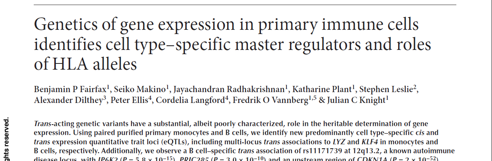
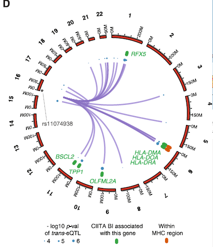

# Interpreting genomic variation

* Sequencing of patient genomes increasingly common
* Can identify relevant variants

. . .

* ... amongst a large number of unrelated variants
* Computational strategies can narrow the set of candidates

. . .

* ... but non-coding variants are difficult to interpret
* Want to leverage existing data as much as possible 

Typical sequencing studies either focus on individual patients (or trios)
or larger cohorts.

Obviously these serve different objectives, either individual diagnosis/treatment
or generally gaining better understanding of phenotype.

Variants of interest may be rare or common.

Understanding the impact of exonic variation is relatively easy (but not without
pitfalls). Non-coding variation is much harder.

# Exome sequencing
## Identifying novel Breast and Ovarian Cancer risk genes {.small-header}

	
* Several DNA repair genes implicated in breast and ovarian cancer susceptability.
* Strong evidence that rare loss-of-function variants confer increased risk.

* Sequenced exomes of 507 DNA repair genes in 1,150 patients.
* Sequenced pools of 24 individuals.
* Included 79 individuals with known mutations in breast cancer predisposition 
  genes as positive controls. 

	

## Analysis strategy

* Sequence pools with HiSeq2000
   * $\gt$ 480$\times$ coverage in 90% of target region
* Call variants in pools with [Syzygy](http://sourceforge.net/projects/syzygy/)
    * Good sensitivity for rare variants (24/26 SNPs and 51/54 indels)
    * Identified 34,564 variants
* 
  Functional annotation obtained via EnsEMBL 
    * 
      Substantial clean-up and curation of annotations 
    * 
      Focused on 1,044 protein truncating variants
      
## Variant annotation

* Variant annotations depend on quality of transcript annotations.
* Different annotation software may give different results.

 

## Results

* Identified genes enriched for PTVs.
* Strongest PTV enrichment observed for PPM1D.
* Observed clustering of variants in final exon.

Sequenced affected exon in  7,781 cases and 5,861 controls

* 18 PTVs in 6,912 breast cancer cases
* 12 PTVs in 1,121 ovarian cancer cases
* 1 PTV in controls

* Removed variants used as positive controls.
* Five individuals had PPM1D PTVs in discovery cohort.
* 25 PTVs total
* Relative risk: BC 2.7, OV 11.5

## PPM1D

* Induced in p53 dependent manner
* Contributes to deactivation of p53
* Part of negative feedback loop required to escape p53-dependent cell cycle arrest

. . .

* Identified truncated proteins show increased activity.
* PPM1D over-expression previously associated with breast cancer. 

# Non-coding variants: More information needed {.small-header}

## Interpreting non-coding variants {.small-header}

* Impact of non-coding variants unclear
* Affected genes not obvious
* Effect on gene expression typically unknown
* 
  Existing epigenetic data may help
* 
  eQTL analyses can help to establish links between SNPs and genes

## Using additional genome-wide data {.small-header}

ChIP-seq and RNA-seq data provide insight into the functional implications
of genotypes. **But** need to consider

* Relevant cell type
* Relevant conditions

## The role of rs11074938 {.small-header}

* SNP (A/G) located in intron of CIITA
* Inside regulatory region 
* CIITA is important regulator of MHC class II expression
* Could have implications for immune related diseases  
  (*if this SNP affects CIITA*)

Annotations suggest SNP may have functional significance.

Unclear which gene is affected and to what extend.

## Changes to gene expression {.small-header}

* 
  eQTL analysis in B cells shows reduced expression of CIITA associated with G allele
  
* 
  Evidence for changes in expression of CIITA target genes
  
* 
  Reduced presence of MHC class II proteins on cell surface associated with G allele
  

